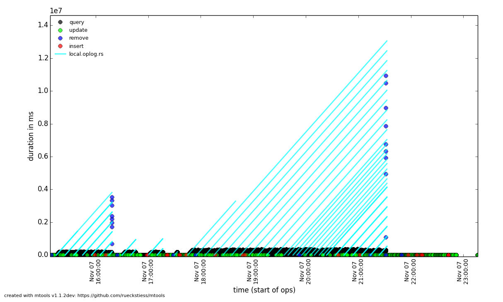

.. _mplotqueries:

============
mplotqueries
============

**mplotqueries** is a tool to visualize operations in MongoDB log files. It has
several different plot types and can group information in various ways.

Usage
~~~~~

.. code-block:: bash

   mplotqueries [-h] [--version] logfile [logfile ...]
                [--group GROUP]
                [--logscale]
                [--type {nscanned/n,rsstate,connchurn,durline,histogram,range,scatter,event} ]
                [--overlay [ {add,list,reset} ]]
                [additional plot type parameters]
                [--checkpoints]

**mplotqueries** can also be used with shell pipe syntax, for example:

.. code-block:: bash

   mlogfilter logfile [parameters] | mplotqueries --type histogram

General Parameters
~~~~~~~~~~~~~~~~~~

Help
----
``-h, --help``
   shows the help text and exits.

Version
-------
``--version``
   shows the version number and exits.

Logarithmic Scale
-----------------
``--logscale``
   This option enables the logarithmic scale for plots where this makes sense.
   This is very useful if the plot contains outliers that squash all other data
   points to the bottom of the graph (see below comparison on the same data
   between log scale disabled and enabled). It can also be enabled with the
   ``l`` (lowercase ``L``) shortcut once a plot is rendered. Switching scale on
   an already rendered plot may take a few seconds before the new scale is
   shown.

Custom Title
------------
``--title``
   This option lets you overwrite the default title (the file name(s)) with a
   custom title. If the title contains spaces, the full title needs to be
   quoted in strings. The title of a plot is shown above the graph. A file read
   in from ``stdin`` does not use a title.

Operation Start Time
--------------------
``--optime-start``
   Events are written to the log file when they finish, and by default,
   mplotqueries plots the operation on the x-axis at that point in time.
   Sometimes, it can be useful to see when operations started instead. For
   operations that have a duration (queries, updates, etc.) mplotqueries can
   subtract the duration and plot the operation when it started instead. Turn
   this feature on with the ``--optime-start`` flag.

Output to File
--------------
``--output-file``
   With this option, the plot can be written to a file rather than opening the
   interactive view window. The format is auto-recognized from the filename
   extension, with many supported formats, e.g. ``.png``, ``.pdf``, ...

Checkpoints
-----------------
``--checkpoints``
   This parameter enables information about slow checkpoints under WiredTiger, if
   available in the log files. The duration of checkpoints will be displayed in
   milliseconds. Terminal output will give an overview of the number of points
   to be plotted on the graph. The graph will contain the datetime and duratio
   (in milliseconds) of slow checkpoints.

Groupings
~~~~~~~~~

Group By
--------
``--group GROUP``

   The group parameter specifies what the data should be grouped on. Grouping
   can have different meaning for the various plots below, but generally,
   groups are represented by color. A scatter plot would choose one color for
   each group. A histogram plot would also choose a color per group, but
   additionally stack the histogram groups on top of each other. Some plots
   don't support grouping at all. See :ref:`plot-types` for information about
   their grouping behavior.

The following values are possible for ``GROUP`` for most plots (some plots may
not support all groups):

*  ``namespace`` (default for single file)
*  ``filename`` (default for multiple files)
*  ``operation`` (queries, inserts, updates, ...)
*  ``thread``
*  ``log2code``  (not supported by every plot type)
*  ``pattern`` (query pattern, e.g. ``{foo: 1, bar: 1}``, no sub-documents)
*  custom grouping with regular expressions (see `Python's regex syntax
   <http://docs.python.org/2/library/re.html#regular-expression-syntax>`__)

For example:

.. code-block:: bash

   mplotqueries mongod.log --group operation

This command creates a scatter plot on duration (by default) and colors the
operations (queries, inserts, updates, deletes, commands, getmores) in
individual colors.

For example:

.. code-block:: bash

   mlogfilter mongod.log --operation update --namespace test.users |
   mplotqueries --type histogram --group "_id: ObjectId\('([^']+)'\)"

This command combination creates a histogram plot on duration of all the update
operations on the ``test.users`` collection and groups the updates based on the
``_id`` ObjectId (extracted by the regular expression). If parentheses are
present in the regular expression, then only the first matched group is being
used as the group string (in this case, the 24 hex characters in the ObjectId).
If parentheses are not present, the full regex match is being used as group
string. Parentheses (and other reserved symbols) that need to be matched
literally (like the parentheses in ``ObjectId('...')`` above) need to be
escaped with a ``\``.

If the number of groups is large, like in this example, it can be reduced with
:ref:`group-limits`.

.. _group-limits:

Group Limits
------------
``--group-limit N``
   This parameter will limit the number of groups to the top ``N``, based on
   the number of matching lines per group (descending). The remaining groups
   are then grouped together in a single bucket called ``other``. This option
   is useful if the number of groups is very large, as repetitions in color
   (there are only 14 distinct colors) could otherwise make it hard to
   distinguish all the groups for some plot types.

   For example:

   .. code-block:: bash

      mplotqueries mongod.log --type range --group log2code --group-limit 10

   This command creates a range plot, grouped on ``log2code``, but only
   displays the 10 most frequently occurring log messages as separate groups.
   All others are plotted as one additional group ``others``.

   .. figure:: images/mplotqueries_group_limit.png
      :alt: Example plot: group limits

.. _plot-types:

Plot Types
~~~~~~~~~~

Connection Churn Plot
---------------------

``--type connchurn``
   A connection churn plot is a special plot that only considers lines about
   opening and closing connections. It will then create an opened (green bars)
   vs. closed (red bars) plot over time, and additionally show the number of
   currently open connections (black line, only for MongoDB log files >= 2.2).

Available Groupings
^^^^^^^^^^^^^^^^^^^

No groupings are supported by this type of plot.

Additional Parameters
^^^^^^^^^^^^^^^^^^^^^

``--bucketsize SIZE, -b SIZE (alias)``
   As with histogram plots, this parameter sets the bucket size for an
   individual bucket (bar). The unit is measured in seconds and the default
   value is 60 seconds. This needs to be adjusted if the total time span of a
   log file is rather large. More than 1000 buckets are slow to render, and
   **mplotqueries** will output a warning to consider increasing the bucket
   size.

   For example:

   .. code-block:: bash

      mplotqueries mongod.log --type connchurn --bucketsize 600

   This command plots connection churn per 10 minutes (600 seconds) as a
   bi-directional histogram plot, as well as the total number of open
   connections at each time (black line).

Duration Line Plot
------------------

``--type durline``
   The Duration Line plot shows operations that have a duration (like queries,
   updates, inserts, commands, etc). It draws a diagonal line from when the
   operation started (touching the x-axis) to when the operation stopped. This
   plot is especially useful to see when operations started and what impact
   they had on other queries during that time. It has the nice side-effect that
   all operations that started at the same time lie on the same diagonal line.
   Duration Line plots also make good plots to overlay with others.

   For example:

   .. code-block:: bash

      grep "oplog.rs" mongod.log | mplotqueries --type durline --overlay
      mplotqueries mongod.log --group operation

   This command plots long-running oplog.rs operations as duration lines, and
   overlays them with a scatter plot of all operations.

Event Plot
----------

``--type event``
   Event plots show the occurrence of certain events in a log file. They make
   sense mostly in combination with a preceding filter, either ``mlogfilter``
   or a ``grep``. For each matching event, a vertical line will be plotted at
   the time the event occurred. If the number of events is very large, you may
   want to consider using a range plot instead.

   For example:

   .. code-block:: bash

      grep "getlasterror" mongod.log | mplotqueries --type event

   This plot shows the occurrences of all "getlasterror" events in the log
   file.

Available Groupings
^^^^^^^^^^^^^^^^^^^

Event plots use colors and to display different groups. The supported groupings
for event plots are: ``namespace``, ``operation``, ``thread``, ``filename``
(for multiple files), and regular expressions.

Additional Parameters
^^^^^^^^^^^^^^^^^^^^^

No additional parameters are supported by this type of plot.

Histogram Plot
--------------

``--type histogram``
   Histogram plots don't consider a particular value in the log line (like for
   example scatter plots do), but rather bin the occurrence of log lines
   together in time buckets and present the result as a bar chart. The more
   occurrences of a certain log line (per group) in a given time frame, the
   higher the bar for that bucket. The size of a bucket is 60 seconds by
   default, but can be configured to another value (``--bucketsize``, see
   below). Unless one wants to know the total number of log lines per time
   bucket (which is not very useful information), this command should always be
   preceded with a filter, for example :ref:`mlogfilter` or
   `grep <http://unixhelp.ed.ac.uk/CGI/man-cgi?grep>`__.

Available Groupings
^^^^^^^^^^^^^^^^^^^

Histogram plots use colors to display different groups. Each group gets its own
bar, the bars are stacked on top of each other to also give an indication of
the total number of matched lines per bucket. The supported groupings for
histogram plots are: ``namespace``, ``operation``, ``thread``, ``filename``
(for multiple files), ``log2code`` and regular expressions.

Additional Parameters
^^^^^^^^^^^^^^^^^^^^^

``--bucketsize SIZE, -b SIZE (alias)``
   This parameter sets the bucket size for an individual bucket (bar). The unit
   is measured in seconds and the default value is 60 seconds. This needs to be
   adjusted if the total time span of a log file is rather large. More than
   1000 buckets are slow to render, and **mplotqueries** will output a warning
   to consider increasing the bucket size.

   For example:

   .. code-block:: bash

      mlogfilter mongod.log --operation insert |
      mplotqueries --type histogram --bucketsize 3600

   This command plots the inserts per hour (3600 seconds) as a histogram plot.
   By default, the grouping is on ``namespace``.

Range Plot
----------

``--type range``
   Range plots are good in displaying when certain events occurred and how long
   they lasted. For example, you can grep for a certain error message and use
   the range plot to see when these errors mostly occurred. For each group, a
   range plot shows one or several (if the ``--gap`` option is used) horizontal
   bars, that go from beginning to end of a certain event. If no ``--gap``
   value is provided, the default is to not have any gaps at all, and the bar
   goes from the time of the first to the time of the last line of that group.
   If ``--gap`` is used, then the bar is interrupted whenever two consecutive
   log lines are further apart than the gap threshold.

Available Groupings
^^^^^^^^^^^^^^^^^^^

Range plots use colors to display different groups. Each group gets its own
horizontal bar(s). The supported groupings for range plots are: ``namespace``,
``operation``, ``thread``, ``filename`` (for multiple files), ``log2code`` and
regular expressions.

For example:

.. code-block:: bash

   mplotqueries primary.log seconary1.log secondary2.log --type range

This plot shows for multiple files when they start and finish. By default, the
grouping for multiple files is on ``filename``, and as there is no gap
threshold given, the bars range from the first two the last log line per file.
This is useful to find out if and where several log files have an overlap.

Additional Parameters
^^^^^^^^^^^^^^^^^^^^^

``--gap LEN``
   If a gap threshold is provided, then the horizontal bars are interrupted
   when two consecutive events of the same group are further apart than ``LEN``
   seconds.

   For example:

   .. code-block:: bash

      mplotqueries mongod.log --type range --group operation --gap 600

   This plot shows ranges of contiguous blocks of updates where the gap
   threshold is 600 seconds (only gaps between two operations that are larger
   than 10 minutes are displayed as separate bars).

Replica Set State Plot
----------------------

``--type rsstate``
   Replica set state plots are specialized event plots, that only consider
   lines about replica set state changes in a log file. They will display all
   changes of all replica set members (not just the node itself) with colored
   vertical lines, indicating different states. The most common states are
   ``PRIMARY``, ``SECONDARY``, ``ARBITER``, ``STARTUP2``, ``DOWN`` and
   ``RECOVERING``, but other state changes are also displayed if found. This
   plot type helps to quickly determine any state changes at a given time. It
   is also useful to :ref:`overlay` this plot with a different plot, for
   example a scatter plot.

   For example:

   .. code-block:: bash

      mplotqueries mongod.log --type rsstate

   This plot shows the state changes of all replica set members found in the
   log file.

Available Groupings
^^^^^^^^^^^^^^^^^^^

No groupings are supported by this type of plot.

Additional Parameters
^^^^^^^^^^^^^^^^^^^^^

No additional parameters are supported by this type of plot.

Scatter Plot
------------

``--type scatter`` (default)
   A scatter plot prints a marker on a two-dimensional axis, where the x-axis
   represents date and time, and the y-axis represents a certain numeric value.
   The numeric value for the y-axis can be chosen with an additional parameter
   (``--yaxis``, see below). By default, scatter plots show the duration of
   operations (queries, updates, inserts, deletes, ...) on the y-axis.

Available Groupings
^^^^^^^^^^^^^^^^^^^

Scatter plots use colors and additionally different marker shapes (circles,
squares, diamonds, ...) to display different groups. The supported groupings
for scatter plots are: ``namespace``, ``operation``, ``thread``, ``filename``
(for multiple files), and regular expressions.

Additional Parameters
^^^^^^^^^^^^^^^^^^^^^

``--yaxis FIELD``
   This parameter determines what value should be considered for the location
   on the y-axis. By default, the y-axis plots ``duration``. Other
   possibilities are ``nscanned``, ``nupdated``, ``ninserted``, ``ntoreturn``,
   ``nreturned``, ``numYields``, ``r`` (read lock), ``w`` (write lock).

   For example:

   .. code-block:: bash

      mplotqueries mongod.log --type scatter --yaxis w

   This command plots the time (x-axis) vs. the write lock values of all
   operations (y-axis). Only lines that have a write lock value present are
   considered for the plot. Note that the unit for read/write lock is in
   microseconds.

``--type nscanned``
   The scan ratio plot is a special type of scatter plot. Instead of plotting a
   single field as the standard scatter plot, it will calculate the ratio
   between the nscanned value and the nreturned value, and uses that result as
   the value for the y-axis. This plot is very useful to quickly find
   inefficient queries.

   For example:

   .. code-block:: bash

      mplotqueries mongod.log --type nscanned/n

.. _overlay:

Overlays
~~~~~~~~

The overlay mechanism allows you to overlay several plot types in one graphic.
This is useful to see correlations, match information from different plot types
and create graphs that show events from different angles.

Each of the plot types can in theory be used as an overlay, however some of
them make more sense then others.

Overlays are created just as normal plots, except they are stored on disk and
do not render immediately. The first call to **mplotqueries** that does not add
another overlay then will load all existing overlays added previously and
render them on top of each other, matching the time axis.

Overlays are stored globally and are persistent, independent of your current
working directory. Therefore, if you no longer need to store added overlays,
make sure that you remove them again or they will be added to your next call of
**mplotqueries**.

Plot types that are often used for overlays are: event, range, rsstate, and
scatter.

Creating Overlays
-----------------

``--overlay [add]``
   To create an overlay, run **mplotqueries** as you would normally, with all
   the command line arguments. In addition, specify the ``--overlay add``
   argument. As ``add`` is the default for overlays, it can be omitted.

For example:

.. code-block:: bash

   mplotqueries mongod.log --type scatter --overlay

   Created overlay: 18124963

This will add an overlay plot. The plot is not shown but saved on disk
instead, and rendered with the next call without ``--overlay``.

List Existing Overlays
----------------------

``--overlay list``
   To see if overlays are currently existing, you can use this command. A list
   of existing overlay identifiers will be returned. Currently, the
   indentifiers are not all that useful by themselves, but the command will
   show you how many different overlays exist.

Remove Overlays
---------------

``--overlay reset``
   To remove all overlays, you can use this command. It will delete all
   existing overlays, and the next (or current, if a log file is specified as
   well) call to **mplotqueries** will not show additional overlays anymore.
